

<h1><kbd></kbd></h1>
An extension for MIT App Inventor 2. 
Firebase Cloud Messaging receiver extension. Developed by Hridoy.

## 📝 Specifications
* **
📦 **Package:** com.hridoy.fcm  
💾 **Size:** 1 MB  
⚙️ **Version:** 2.0.0  
📱 **Minimum API Level:** 14  
📅 **Updated On:** 26-05-2026 SAST  
💻 **Built & documented using:** [FAST](https://community.appinventor.mit.edu/t/fast-an-efficient-way-to-build-publish-extensions/129103?u=jewel) <small><mark>v6.1.0</mark></small>

---

## All Blocks
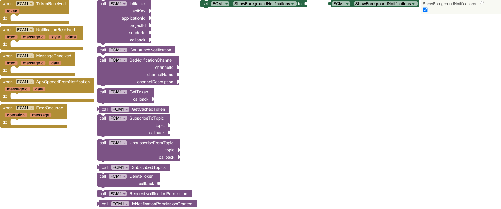

---

## Events

<kbd>Events (5)</kbd>

### 1. TokenReceived
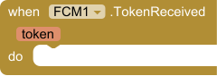

Fired when the FCM token is automatically refreshed by Firebase.
Send the new token to your server immediately.

| Parameter | Type | Desciption                 |
|-----------|------|----------------------------|
| token     | text | new FCM registration token |

---

### 2. NotificationReceived
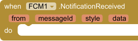

Fired when a notification-type FCM message arrives.
Always fires in foreground.

| Parameter | Type | Description                          |
|-----------|------|--------------------------------------|
| from      | text | sender ID                            |
| messageId | text | unique message identifier            |
| style     | dictonary | notification style data in dictonary |
| data      | dictonary | extra data payload in dictonary      |

---

### 3. MessageReceived
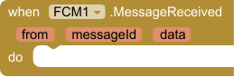

Fired when a data-only FCM message arrives.
Delivered regardless of app state. No notification is shown.

| Parameter  | Type | Description                                      |
|------------|------|--------------------------------------------------|
| from       | text | sender ID                                        |
| messageId  | text | unique message identifier                        |
| data   | dictonary | extra data payload in dictonary                        |

---

### 4. AppOpenedFromNotification
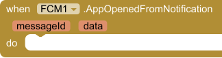

Fired when the user taps a notification and the app opens.

Two scenarios:  
• App killed — call GetLaunchNotification() in Screen.Initialize  
• App in background — fires automatically via onResume

| Parameter  | Type | Description                      |
|------------|------|----------------------------------|
| messageId  | text | ID of the tapped notification    |
| data   | dictonary | extra data payload in dictonary                        |

---

### 5. ErrorOccurred
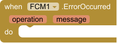

Fired when any FCM operation fails outside of a callback context.

| Parameter | Type | Description                    |
|-----------|------|--------------------------------|
| operation | text | name of the method that failed |
| message   | text | error description              |

---

## Methods

<kbd>Methods (11)</kbd>

### 1. Initialize
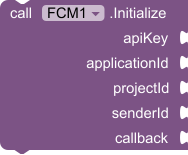

Initializes Firebase with your project credentials.
Call this once at app startup before any other FCM method.

| Parameter     | Type      | Description                                                                                                      |
|---------------|-----------|------------------------------------------------------------------------------------------------------------------|
| apiKey        | text      | Web API key                                                                                                      |
| applicationId | text      | App ID (e.g. 1:123:android:abc)                                                                                  |
| projectId     | text      | Project ID (e.g. my-app-123)                                                                                     |
| senderId      | text      | Sender ID / Cloud Messaging number                                                                               |
| callback      | procedure | Need 2 param:  • status (boolean: true = success, false = failure) • errorMessage (text: empty if success) |

---

### 2. GetLaunchNotification

Call this in Screen.Initialize to check if the app was opened
by tapping a notification while the app was killed or in background.

If the app was opened from a notification tap, fires
AppOpenedFromNotification immediately.
If the app was opened normally, does nothing.

Recommended call order in Screen.Initialize:

1. call FCM.Initialize(...)

2. In Initialize callback (status = true):
   → call FCM.GetLaunchNotification()
   → call FCM.GetToken(...)

---

### 3. SetNotificationChannel
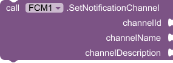

Configures the Android notification channel for all FCM notifications.
Call before the first notification is displayed.
No-op on Android 7 and below.

| Parameter          | Type | Description                          |
|--------------------|------|--------------------------------------|
| channelId          | text | unique ID (e.g. 'my_channel')        |
| channelName        | text | name shown in system settings        |
| channelDescription | text | description shown in system settings |

---

### 4. GetToken
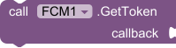

Retrieves the current FCM registration token from Firebase.
Always fetch fresh before sending to your server.

| Parameter | Type      | Description                                                                                                    |
|-----------|-----------|----------------------------------------------------------------------------------------------------------------|
| callback  | procedure | Need 2 parameters: 1) token  (text: FCM token, empty if failed) 2) errorMessage (text: empty if success) |

---

### 5. GetCachedToken

Returns the last known FCM token from local cache.
Returns empty string if no token has been fetched yet.
Use GetToken() to retrieve a fresh token from Firebase.

* Return type: `text`

---

### 6. SubscribeToTopic

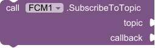

Subscribes this device to an FCM topic.
Checks local cache first — skips Firebase call if already subscribed.
Topic names must match [a-zA-Z0-9-_.~%] and be under 900 chars.

| Parameter | Type      | Description                                                                                                                                                      |
|-----------|-----------|------------------------------------------------------------------------------------------------------------------------------------------------------------------|
| topic     | text      | the topic name                                                                                                                                                   |
| callback  | procedure | Need 3 parameters: 1) status (boolean: true = success, false = failure) 2) topic        (text: the topic name) 3) errorMessage (text: empty if success) |

---

### 7. UnsubscribeFromTopic
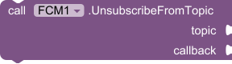

Unsubscribes this device from an FCM topic.

| Parameter | Type      | Description                                                                                                                                                      |
|-----------|-----------|------------------------------------------------------------------------------------------------------------------------------------------------------------------|
| topic     | text      | the topic name                                                                                                                                                   |
| callback  | procedure | Need 3 parameters: 1) status (boolean: true = success, false = failure) 2) topic        (text: the topic name) 3) errorMessage (text: empty if success) |

---

### 8. SubscribedTopics

Returns the list of topics this device is currently subscribed to.
Reads from local cache. No network request.
Returns empty list if not subscribed to any topics.

* Return type: `list`

---

### 9. DeleteToken
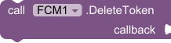

Deletes the current FCM registration token.
Use on user logout to stop receiving targeted notifications.
A new token is generated on the next GetToken() call.

| Parameter | Type      | Description                                                                                                            |
|-----------|-----------|------------------------------------------------------------------------------------------------------------------------|
| callback  | procedure | Need 2 parameters: 1) status (boolean: true = success, false = failure) 2) errorMessage (text: empty if success) |

---

### 10. RequestNotificationPermission

Requests POST_NOTIFICATIONS runtime permission on Android 13+.
No-op on Android 12 and below.
---

### 11. IsNotificationPermissionGranted

Returns true if POST_NOTIFICATIONS permission is granted.
Always returns true on Android 12 and below.

* Return type: `boolean`

---

## Properties

<kbd>Properties (1)</kbd>

### 1. ShowForegroundNotifications

Controls whether notifications are shown when the app is in foreground.
Resets to true each session — call in Screen.Initialize to change.

• true = show notification (default)  
• false = suppress, only fire NotificationReceived event

* Input type: `boolean`

